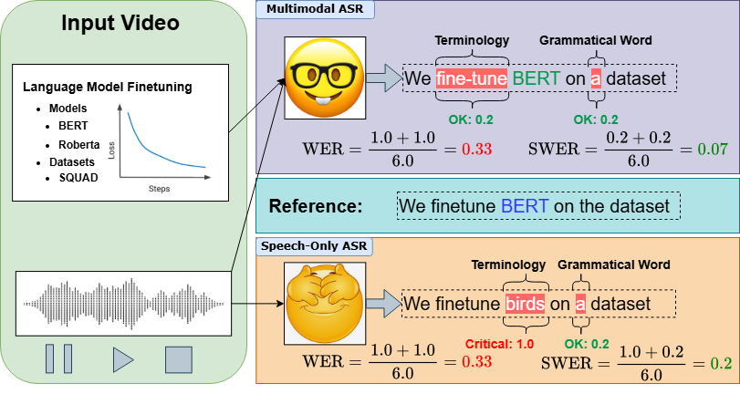
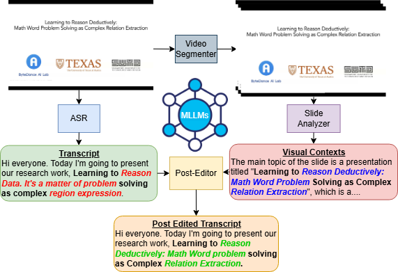

# Exploring the Potential of Multimodal LLM with Knowledge-Intensive Multimodal ASR

This repository contains the implementation and resources for the paper "[Exploring the Potential of Multimodal LLM with Knowledge-Intensive Multimodal ASR](https://arxiv.org/pdf/2406.10880)". The paper presents the Multimodal Scientific ASR (MS-ASR) task and introduces the Scientific Vision-Augmented ASR (SciVASR) framework.


## Abstract
Recent advancements in multimodal large language models (MLLMs) have made significant progress in integrating information across various modalities, yet real-world applications in educational and scientific domains remain challenging. This paper introduces the Multimodal Scientific ASR (MS-ASR) task, which focuses on transcribing scientific conference videos by leveraging visual information from slides to enhance the accuracy of technical terminologies. Realized that traditional metrics like WER fall short in assessing performance accurately, prompting the proposal of severity-aware WER (SWER) that considers the content type and severity of ASR errors. We propose the Scientific Vision Augmented ASR (SciVASR) framework as a baseline method, enabling MLLMs to improve transcript quality through post-editing. Evaluations of state-of-the-art MLLMs, including GPT-4o, show a 45\% improvement over speech-only baselines, highlighting the importance of multimodal information integration.

## Overview


### Key Features
- **Multimodal Scientific ASR (MS-ASR) Task**: Transcribing scientific conference videos by integrating speech and visual content (e.g., presentation slides).
- **Scientific Vision Augmented ASR (SciVASR) Framework**: SciVASR leverages Multimodal Large Language Models (MLLMs) for transcript post-editing, enhancing recognition of technical terminology. It works in a zero-shot manner, requiring no additional training data.
- **Severity-aware WER (SWER)**: A new metric that considers the content type and severity of ASR errors, addressing the limitations of traditional Word Error Rate (WER) by calibrating error severity.

## SciVASR Framework


Corresponding codes are placed in the `src/scivasr` directory. The framework consists of the following components:

1. **ASR**: Transcribe the audio content using an ASR model (e.g. Whisper).
   1. Supported ASR models: `whisper`
2. **Video Segmenter**: Identifies slide boundaries and segments video into scenes.
3. **Slide Analyzer**:  Extracts visual contexts from presentation slides using vision and text-based LLMs.
   1. Supported VLMs: `THUDM/cogagent-vqa-hf`, `THUDM/cogagent-vqa-hf`, `Qwen/Qwen-VL-Chat`, `gpt-4o`
4. **Post-Editor**: Refines transcripts by integrating visual and audio information for enhanced accuracy.
   1. Supported Text LLMs: `gpt-4o`, `meta-llama/Meta-Llama-3-70B-Instruct`, any text LLM that is served through an OpenAI API endpoint.

## How to Use
1. **Clone the Repository**:
```bash
git clone https://github.com/yuriak/MS-ASR
cd MS-ASR
```

2. **Install Dependencies**:
```bash
pip install -r requirements.txt
```

3. **Inference**:
```bash
bash scripts/inference.sh
```

4. **Evaluation**:
```bash
bash scripts/evaluation.sh
```
If you want to use the SWER metric, please refer to the `src/scivasr/swer.py` file for configuration details.

## Citation
If you use our work, please consider citing:
```
@article{wang2024exploring,
      title={Exploring the Potential of Multimodal LLM with Knowledge-Intensive Multimodal ASR}, 
      author={Minghan Wang and Yuxia Wang and Thuy-Trang Vu and Ehsan Shareghi and Gholamreza Haffari},
      year={2024},
      eprint={2406.10880},
      archivePrefix={arXiv},
      primaryClass={cs.CL},
      url={https://arxiv.org/abs/2406.10880}, 
}
```